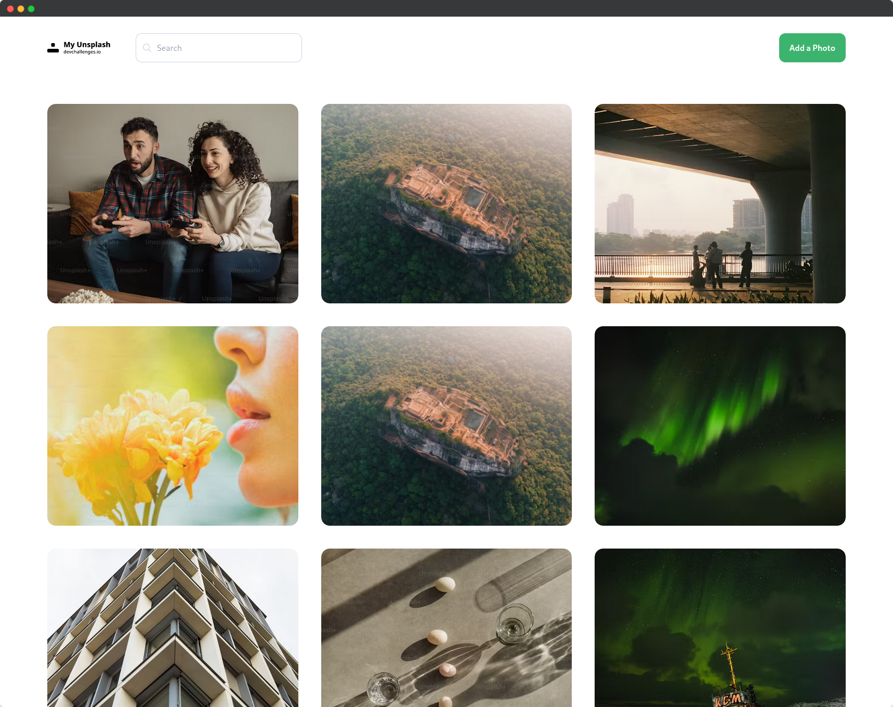
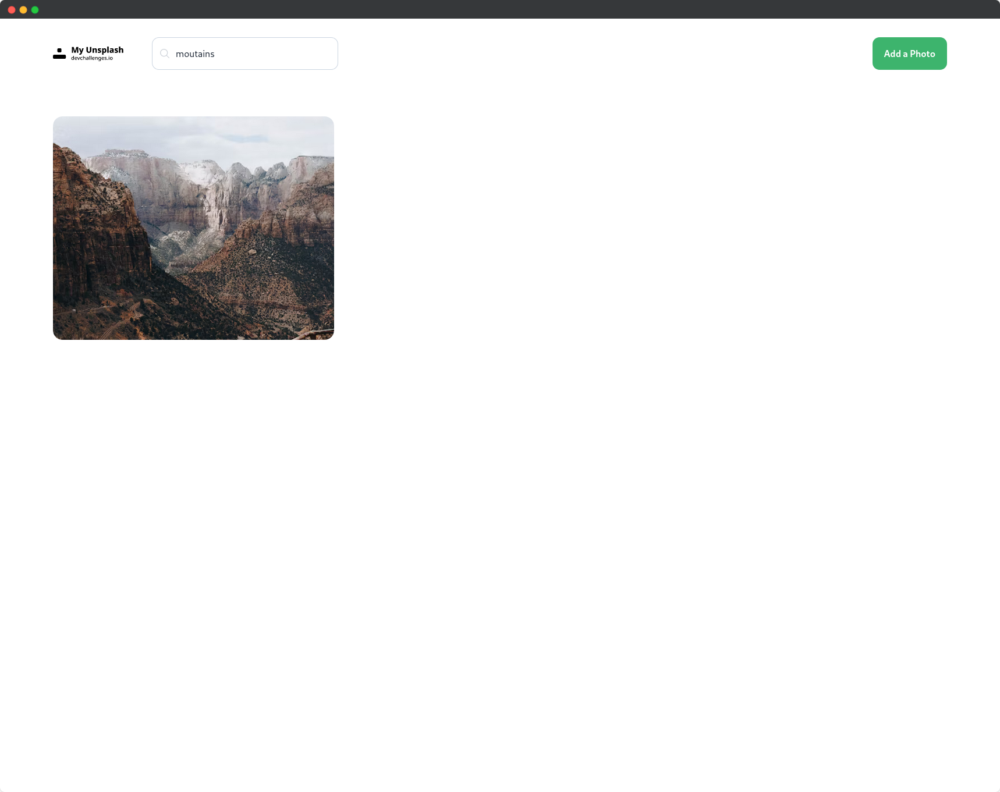

# My Unsplash App

This project is my implementation of a Unsplash-like application, built using Spring Cloud for the backend and Svelte for the frontend. It aims to provide users with functionalities to manage and browse through a collection of photos.
Table of Contents

- [Features](#features)
- [Illustrative Images](#illustrative-images)
- [Technologies Used](#technologies-used)
- [Setup Instructions](#setup-instructions)

## Features

- Display photos in a masonry layout.
- Add new photos to the list (new photo appears at the top).
- Search for photos by label.
- View labels and delete buttons when hovering over a photo.
- Delete images with optional password confirmation.

## Illustrative Images




## Technologies Used

- Frontend:
     - Svelte
     - DaisyUI
     - Tailwindcss
- Backend:
     - Spring Cloud
     - DynamoDB

## Setup Instructions

1. Clone the repository.

```bash
git clone git@github.com:pixelHat/myunsplash.git
```

2. Set up the following environment variables for the backend:

```bash
export AWS_DYNAMODB_USER=your_dynamodb_user
export AWS_DYNAMODB_PASSWORD=your_dynamodb_password
export AWS_DYNAMODB_ENDPOINT=your_dynamodb_endpoint
export AWS_DYNAMODB_REGION=your_dynamodb_region
```

3. Create a DynamoDB table named Photos.

4. Navigate to the backend directory.

```bash
cd unsplash-app/backend
```

5. Build the backend using Maven.

```bash
mvn clean install
```

6. Run the backend server.

```bash
mvn spring-boot:run
```

7. Open another terminal and navigate to the frontend directory.

```bash
cd unsplash-app/frontend
```

8. Install dependencies.

```bash
npm install
```

9. Start the frontend development server.

```bash
npm run dev
```

10. Start the frontend development server with proxy to avoid CORS.

```bash
npm run proxy
```

11. Open your browser and navigate to http://localhost:5173 to view the application.
